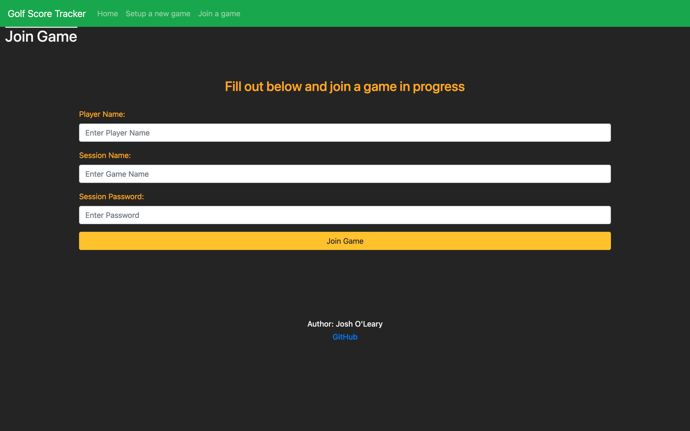

# Golf Score Tracker Web Application by Josh O'Leary
## About
This web app built using the python 'flask' web framework acts as a group scorecard for users while playing golf. It allows multiple users to join a session to track their score on each hole. It will then actively update a live leaderboard for the whole course showing all users in the session the scores in a table.

## To Do:
- Allow for multiple different sessions to be played at once

## Current State:

### Game

### Home

### Set-up

### Join

